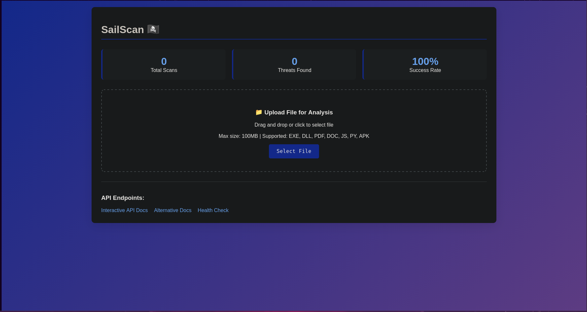

# SailScan 🏴‍☠️

A multi-engine security scanner built with Flask for analyzing files, detecting threats, and reverse engineering.



## ✨ Features

- **🛡️ VirusTotal Integration**: 60+ antivirus engines
- **🔧 Static Analysis**: File structure, hashes, signatures
- **📱 Mobile Analysis**: APK/IPA support, Flutter detection
- **⚡ Frida Integration**: Dynamic instrumentation (optional)
- **🌐 Web Dashboard**: Clean, modern interface
- **📊 REST API**: Full API for automation
- **💾 Database**: Scan history and results storage

## 🚀 Quick Start

### Prerequisites
- Python 3.8+
- pip package manager

### Installation

```bash
# 1. Clone repository
git clone https://github.com/zaephyrz/SailScan-.git
cd SailScan

# 2. Run setup script
chmod +x setup.sh
./install_dependencies.sh

# 3. Edit .env file (add your VirusTotal API key)
nano .env

# 4. Start the application
python sailscan.py