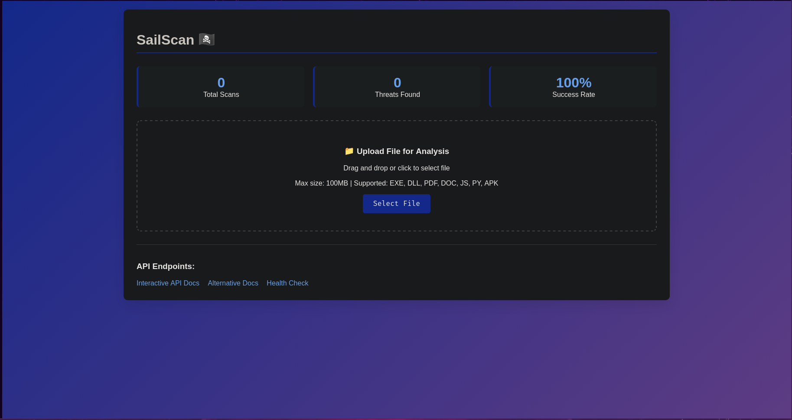

# SailScan 🏴‍☠️ - A Security Scanner and CVE Checker

A lightweight security scanning tool built with FastAPI for analyzing files, detecting threats, and managing vulnerabilities.



## 🚀 Quick Start

### Prerequisites
- Python 3.8+
- Git

### Installation

1. **Clone the repository**
```bash
git clone https://github.com/zaephyrz/SailScan.git
cd sailscan
```

2. **Create virtual environment**
```bash
python -m venv venv
source venv/bin/activate  # On Windows: venv\Scripts\activate
```

3. **Install dependencies**
```bash
pip install -r requirements.txt
```

4. **Run the application**
```bash
uvicorn app.main:app --reload
```

5. **Open your browser**
- Dashboard: http://localhost:8000
- API Documentation: http://localhost:8000/docs
- Health Check: http://localhost:8000/health

## 🛠️ Features

### 📁 File Analysis
- Upload and scan multiple file types
- Hash calculation (MD5, SHA256)
- Basic threat detection

### ⚠️ Security Dashboard
- Real-time scan statistics
- Threat severity visualization
- Scan history tracking

### 🔧 API Integration
- RESTful API for automation
- Swagger/OpenAPI documentation
- Webhook support

## 📁 Supported File Types

- **Executables**: `.exe`, `.dll`
- **Documents**: `.pdf`, `.doc`, `.docx`
- **Scripts**: `.js`, `.py`
- **Mobile Apps**: `.apk`, `.ipa`
- **Archives**: `.zip`, `.rar` (extraction pending)

## 🗂️ Project Structure

```
sailscan/
├── app/
│   ├── main.py              # FastAPI application
│   ├── config.py            # Configuration settings
│   ├── database.py          # Database connection
│   ├── models/              # Database models
│   ├── api/                 # API endpoints
│   ├── core/                # Core scanning logic
│   └── templates/           # HTML templates
├── requirements.txt         # Python dependencies
├── .env.example            # Environment template
└── README.md               # This file
```

## 🔌 API Usage

### Basic Scan
```bash
curl -X POST "http://localhost:8000/api/v1/scans/scan/file" \
  -F "file=@suspicious.exe"
```

### Check Status
```bash
curl "http://localhost:8000/api/v1/scans/{scan_id}"
```

## 🔧 Configuration

Copy the example environment file:
```bash
cp .env.example .env
```

Edit `.env` to set:
```env
DATABASE_URL=sqlite:///./security.db
SECRET_KEY=your-secret-key-here
DEBUG=True
```

## 🐳 Docker Support

```bash
# Build and run with Docker
docker build -t sailscan .
docker run -p 8000:8000 sailscan

# Or use Docker Compose
docker-compose up
```

## 📈 Development Roadmap

- [ ] VirusTotal API integration
- [ ] CVE database synchronization  
- [ ] Advanced malware detection
- [ ] PDF report generation
- [ ] Docker containerization
- [ ] Multi-user support

## 🤝 Contributing

1. Fork the repository
2. Create a feature branch (`git checkout -b feature/AmazingFeature`)
3. Commit changes (`git commit -m 'Add AmazingFeature'`)
4. Push to branch (`git push origin feature/AmazingFeature`)
5. Open a Pull Request

## 📄 License

This project is licensed under the AGPLv3 License - see the [LICENSE](LICENSE) file for details.

## 🆘 Support

- 📖 [Documentation](http://localhost:8000/docs)
- 🐛 [Issue Tracker](https://github.com/zaephyrz/SailScan/issues)
- 💬 Discussions: GitHub Discussions


**Made with 💙 in Python and FastAPI**

<p align="center">
  
  
  
</p>

## Quick Commands Cheatsheet

```bash
# Start development server
uvicorn app.main:app --reload

# Run tests
pytest tests/

# Format code
black app/

# Check linting
flake8 app/

# Database migrations
alembic upgrade head
```